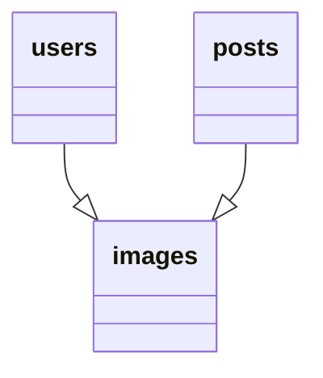
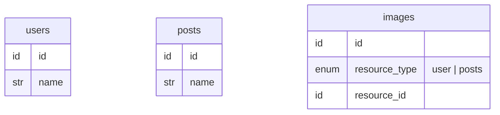
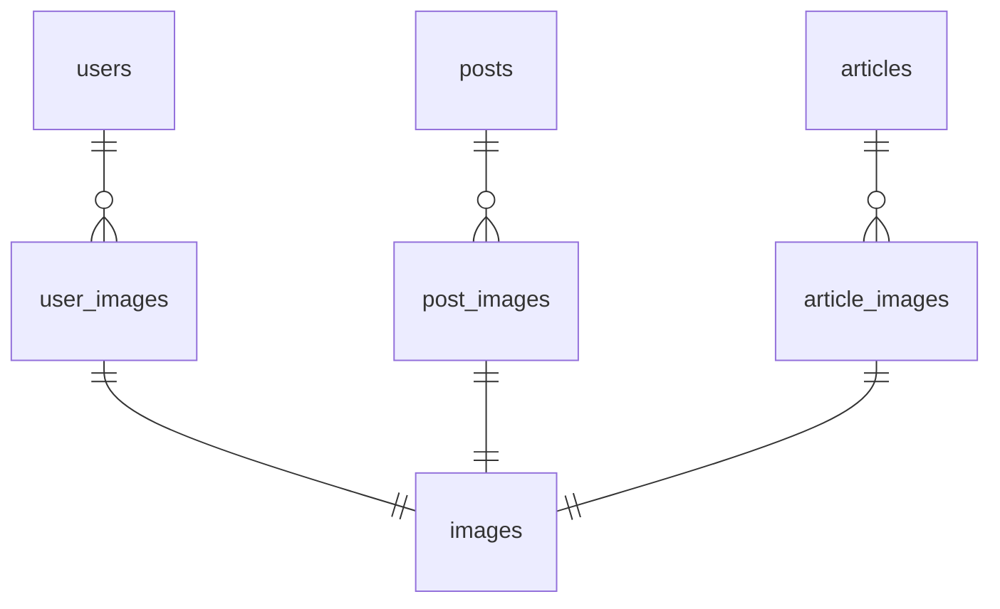

データベースにおけるポリモーフィックは、子テーブルが複数ある親テーブルのうちどれか 1 つと関連することです。

この記事では、 `images` が `users` と `posts` のどちらかを親テーブルとして持つポリモーフィック関連を例に話を進めていきます。



# データベースから見た問題点



ポリモーフィックの 1 番の問題として**テーブル間の関連がなくなる**ことが挙げられます。これは外部キーを設定することができないからです。
外部キーは 2 つのテーブルを関連づけるキーですが、ポリモーフィックの子テーブルでは、行ごとに関連づけられる親テーブルが変わるために外部キーを一意に設定できません。

これにより以下の問題が発生します。

## 参照整合性がなくなる

外部キーを設定できないので、データベース上では参照整合性を保証できません。
そのためアプリケーションコードで制御する必要があります。

:::details 参照整合性
関連づけられているテーブル間のデータが一貫していること。
データベースでは外部キー制約で参照整合性を保証しています。

- MySQL
  https://dev.mysql.com/doc/refman/8.0/ja/create-table-foreign-keys.html
- PostgreSQL
  https://www.postgresqltutorial.com/postgresql-tutorial/postgresql-foreign-key/
  :::

## 移植性が悪くなる

ポリモーフィックを使うと**アプリケーションコードとデータベースが密結合になります。**
これは本来データベースの役割であるテーブル間の関連をアプリケーションコードで制御していることにあります。これによりデータベースがアプリケーションコードに依存し、データベースのみを移植することが難しくなります。

## クエリが複雑になる

ポリモーフィックを利用すると結合時に親テーブルを指定する必要があります。

- user に紐づく画像を取得するクエリ

```sql
SELECT *
FROM users AS u
INNER JOIN images AS i
ON u.id = i.resource_id AND i.resource_type = 'user'
```

- 全ての画像と紐づく親レコードを取得するクエリ
  紐づく親テーブルごとに左外部結合が必要

```sql
SELECT *
FROM images AS i
LEFT OUTER JOIN users AS u
ON u.id = i.resource_id AND i.resource_type = 'user'
LEFT OUTER JOIN posts AS p
ON p.id = i.resource_id AND i.resource_type = 'posts';
```

# ORM でポリモーフィックを使う利点

ポリモーフィックの利点は**コードのシンプルさと柔軟性**にあります。

## シンプルで柔軟

ポリモーフィックはテーブル間の関連をアプリケーションコードで実現することで柔軟性をもたらします。
さらに ORM を使えば参照整合性などの複雑なロジックは、カプセル化されるため Ruby On Rails の ActiveRecord ではたった 1 行でデータベースを変更せずとも子テーブルと関連付けができます。

```ruby
has_many :images, as: :resource
```

# 個人的見解

ポリモーフィックは、**短期的な開発スピードとデータベース構造の複雑化**のトレードオフを伴います。

## ポリモーフィックの柔軟性

ポリモーフィック関連の柔軟性は一見魅力的ですが、同様の柔軟性はデータベースの設計で実現可能です。以下のように中間テーブルを介して親テーブルと子テーブルを関連づけることで、後から新しい親テーブルを追加する事が可能です。



## 結論

ポリモーフィックを使用することで短期的な開発スピードは向上しますが、その代償としてデータベース構造が複雑化します。データベースの複雑性は、プロジェクト全体の見通しを悪くして、かえって生産性やスピード感を低下させます。

長期的なプロジェクトの継続と拡張を考えた時にデータベース構造を複雑化させたくなので ORM のポリモーフィック関連は採用すべきではないと考えました。

# 参考

- SQL アンチパターン
  https://www.oreilly.co.jp/books/9784873115894/
